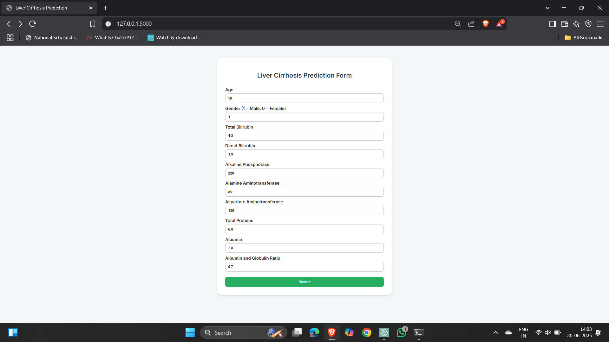
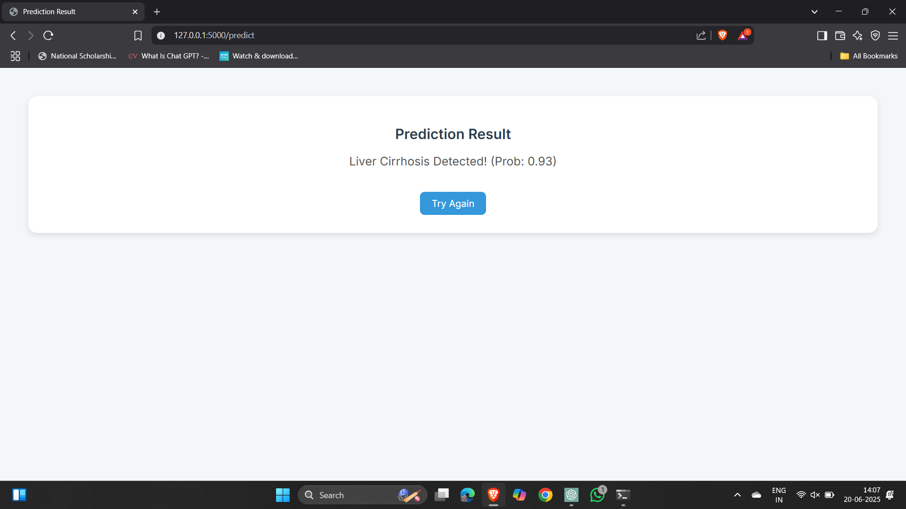

# 🩺 Liver Cirrhosis Prediction Using Machine Learning

**Revolutionizing Liver Care:** A Machine Learning–Powered Web App for Predicting Liver Cirrhosis  
Built with 💻 Python, 🧠 Random Forest, and 🌐 Flask

---

## 📌 Problem Statement

Liver cirrhosis is a life-threatening disease that often goes undetected until advanced stages.  
This project aims to build a predictive model to help **detect liver cirrhosis early** using patient data such as enzyme levels, protein ratios, and age.

---

## 🎯 Objective

- ✅ Predict the likelihood of liver cirrhosis from clinical lab data
- ✅ Provide real-time predictions through a simple web interface
- ✅ Support medical professionals in early intervention and diagnosis

---

## 🧠 Technologies Used

| Area              | Tools & Libraries                         |
|-------------------|-------------------------------------------|
| Programming       | Python 3                                   |
| Data Processing   | Pandas, NumPy                              |
| Visualization     | Matplotlib, Seaborn                        |
| Machine Learning  | Scikit-learn (Random Forest, KNN, etc.)   |
| Web Development   | Flask, HTML, CSS                           |
| Model Deployment  | `rf_acc_68.pkl`, `normalizer.pkl`         |

---

## 📊 Dataset

- **Source**: [UCI Indian Liver Patient Dataset](https://archive.ics.uci.edu/ml/datasets/ILPD+(Indian+Liver+Patient+Dataset))
- **Attributes**: Age, Gender, Bilirubin levels, Enzyme levels (ALT, AST), Protein levels, Albumin, A/G ratio
- **Target**: Cirrhosis Present (1) / Not Present (0)

---

## 🔍 Project Phases

📁 liver-cirrhosis-prediction
├── 1. Project Initialization and Planning Phase
├── 2. Data Collection and Preprocessing Phase
├── 3. Model Development Phase
├── 4. Model Optimization and Tuning Phase
├── 5. Project Executable Files
├── 6. Documentation & Demonstration

Each phase includes markdown documents, notebooks, visuals, and implementation details for clear academic or industrial understanding.

---

## 🚀 How to Run the Project

### 🧱 Prerequisites
- Python 3 installed
- Flask installed  
  ```bash
  pip install flask
▶️ Steps
1.Clone the repository:

git clone https://github.com/madhumitha-2004/liver-cirrhosis-prediction.git

2.Navigate to project folder:

cd liver-cirrhosis-prediction

3.Run the Flask app:

python app.py

4.Visit:

http://127.0.0.1:5000/

📸 Screenshots
## 📸 Screenshots

### 🔹 Input Page:


### 🔹 Prediction Result Page:



📈 Model Performance:

| Metric     | Value              |
| ---------- | ------------------ |
| Accuracy   | \~70.2% ✅          |
| Classifier | Random Forest      |
| Tuned      | Yes (GridSearchCV) |

🙋‍♀️ Author:
Madhumitha Chowdary

📚 License:
This project is for academic and demonstration purposes only. Not intended for actual clinical use without validation.


